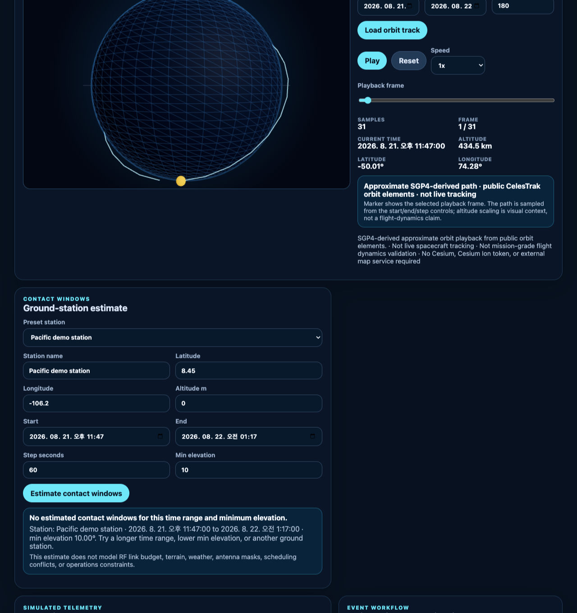
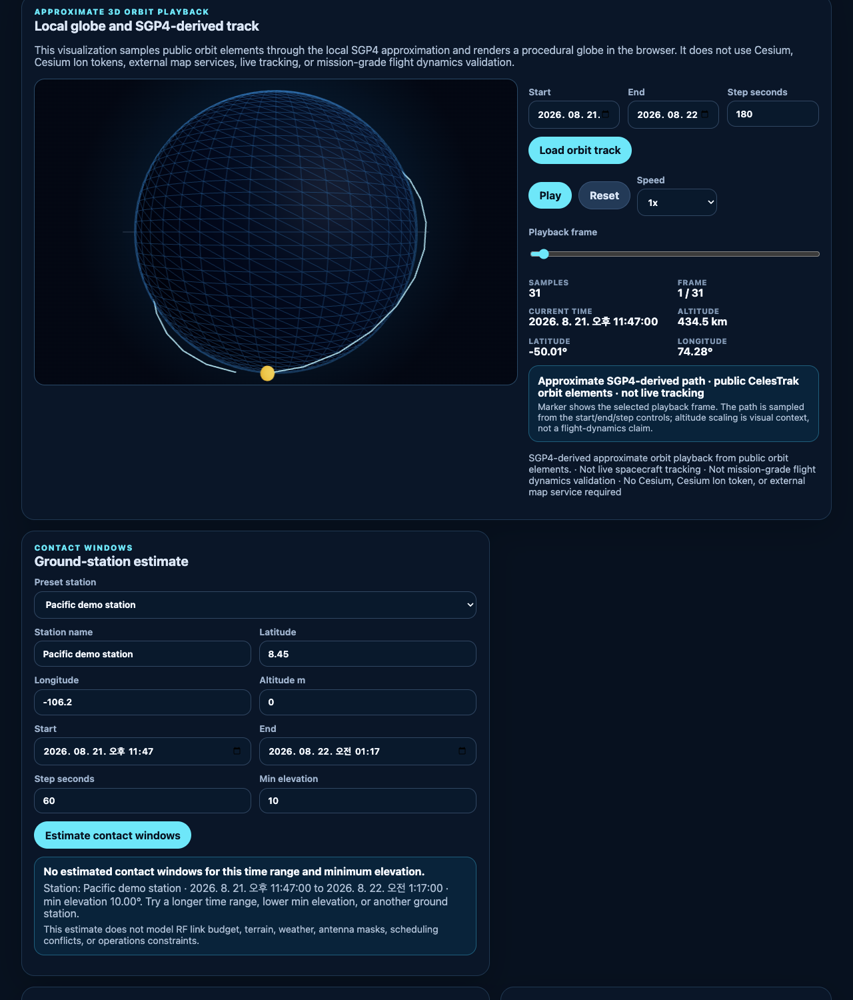
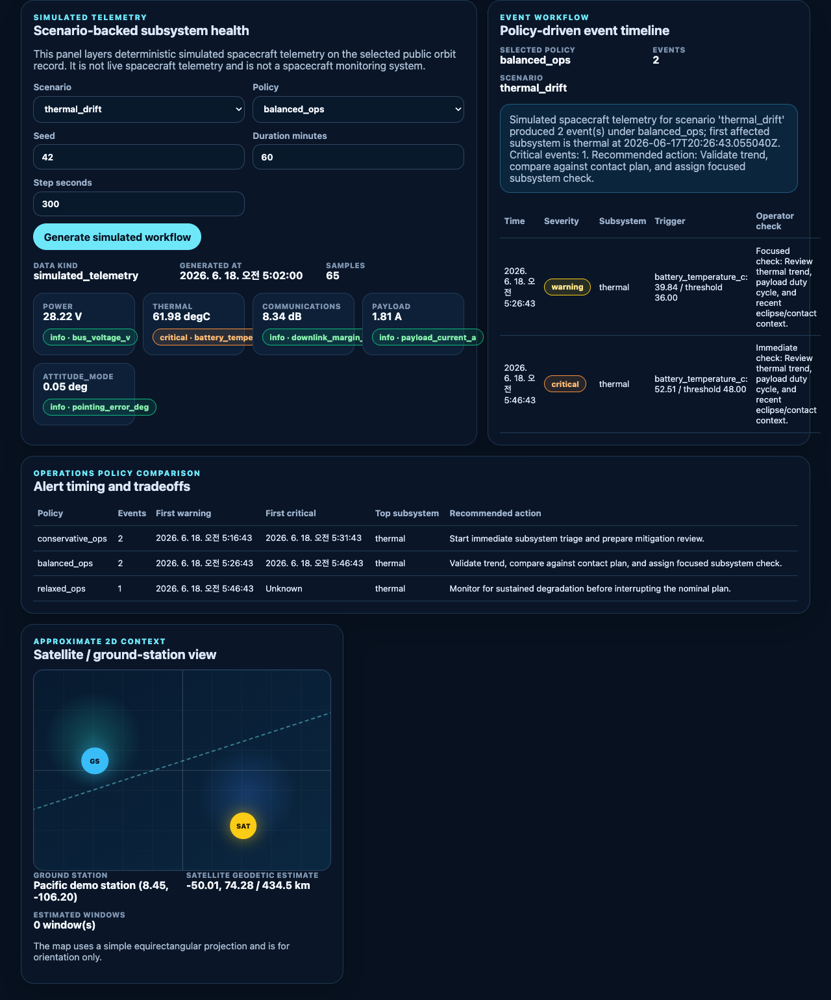
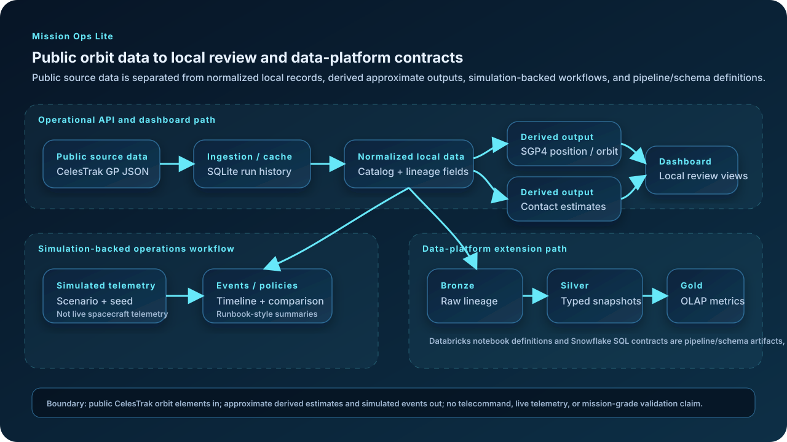

# Mission Ops Lite Walkthrough and Visual Overview

This walkthrough gives a concise local review path for the Mission Ops Lite backend and dashboard. It focuses on what a reviewer can inspect in the repository: public CelesTrak orbit catalog ingestion/cache behavior, source lineage, SGP4-derived approximate outputs, simulation-backed telemetry/event workflows, and the data-platform extension path.

## Boundaries to keep in view

Mission Ops Lite uses public CelesTrak orbit elements and local computation. Dashboard and API outputs are for local review and planning-oriented modeling only:

- catalog records are public CelesTrak GP JSON normalized into a local SQLite cache;
- position, orbit-track, and contact-window outputs are approximate SGP4-derived estimates;
- telemetry, events, and policy comparison outputs are deterministic simulations layered on a selected public orbit record;
- Databricks notebooks and Snowflake SQL are pipeline/schema definitions, not evidence from a live workspace.

It does not provide telecommand, downlink processing, validated contact scheduling, live spacecraft telemetry, or mission-grade operations validation.

## Start the local system

From the repository root, start the backend:

```bash
PYTHONPATH=src uv run python -m uvicorn mission_ops_lite.api:app --host 127.0.0.1 --port 8000
```

In a second terminal, start the dashboard:

```bash
cd frontend
npm install
npm run dev -- --host 127.0.0.1
```

Open:

```text
http://127.0.0.1:5173/
```

The dashboard expects the backend at `http://127.0.0.1:8000` by default.

## Review path

1. Confirm the backend health badge shows `ok`.
2. Use **Load cached catalog** to inspect the latest local catalog, or **Ingest / use cache** to reuse the cache window before requesting the public source again.
3. Select ISS / NORAD `25544` when it is available in the cached or ingested catalog.
4. Inspect the selected satellite's source epoch, ingestion time, freshness, and source lineage.
5. Click **Calculate position** to request an SGP4-derived approximate state for the selected timestamp.
6. Click **Load orbit track** to view the bounded 3D orbit playback panel and its approximation disclaimer.
7. Estimate contact windows for a preset or manual ground station, noting that this does not model RF link budgets, terrain, weather, antenna masks, scheduling conflicts, or operational constraints.
8. Generate the simulated telemetry workflow with a scenario such as `thermal_drift`, seed `42`, and policy `balanced_ops`.
9. Compare the event timeline, runbook-style summary, and policy comparison table across policy profiles.
10. Review the data-platform flow diagram below to see how the same public orbit catalog maps into Bronze/Silver/Gold transforms and SQL/notebook contracts.

## Repo-owned visual evidence

The screenshots below were captured on 2026-08-21 from `http://127.0.0.1:5173/` against a local backend at `http://127.0.0.1:8000` and a cached CelesTrak catalog. The capture flow loaded the cached catalog, selected ISS / NORAD `25544`, calculated position, loaded orbit track, estimated contact windows, generated the `thermal_drift` simulated workflow with seed `42`, and checked the browser console for JavaScript errors. The console check returned no messages and no errors.

They intentionally show the boundary language in the UI.

### Catalog, lineage, selected satellite, and derived position



This view shows backend health, the cached public catalog count, source lineage, the selected ISS / NORAD `25544` record, and an SGP4-derived approximate position panel.

### Orbit playback and contact-window estimate



This view shows the local 3D orbit playback panel with the approximation disclaimer and the contact-window estimator with its modeling limitations.

### Simulated telemetry, event workflow, and policy comparison



This view shows deterministic simulated telemetry for `thermal_drift`, a policy-driven event timeline under `balanced_ops`, and the policy comparison table.

A full-page capture is also available at [`assets/screenshots/dashboard-full-workflow.png`](../assets/screenshots/dashboard-full-workflow.png).

## Data-flow overview



The diagram separates:

- public source data: CelesTrak GP JSON;
- normalized local data: ingestion/cache history and catalog records with lineage fields;
- derived approximate outputs: SGP4 position/orbit/contact APIs;
- simulated telemetry/events: deterministic scenario and policy workflows;
- pipeline/schema definitions: PySpark Bronze/Silver/Gold transforms, Databricks notebook definitions, and Snowflake SQL contracts.

## API smoke examples

With the backend running and a catalog loaded, the same review path can be checked from the API:

```bash
curl http://127.0.0.1:8000/health
curl http://127.0.0.1:8000/satellites/25544
curl 'http://127.0.0.1:8000/satellites/25544/position?at=2026-08-21T23:47:00Z'
curl 'http://127.0.0.1:8000/satellites/25544/contact-windows?ground_station_name=Pacific%20demo%20station&latitude_deg=8.45&longitude_deg=-106.20&start=2026-08-21T23:47:00Z&end=2026-08-22T01:17:00Z&step_seconds=60&min_elevation_deg=10'
curl 'http://127.0.0.1:8000/satellites/25544/telemetry/simulated?scenario=thermal_drift&seed=42&duration_minutes=60&step_seconds=300'
curl 'http://127.0.0.1:8000/satellites/25544/events/simulated?scenario=thermal_drift&policy=balanced_ops&seed=42'
curl 'http://127.0.0.1:8000/satellites/25544/ops-policy-comparison?scenario=thermal_drift&seed=42'
```

If CelesTrak rejects a repeated refresh before its next update window, use the cached catalog path and retry the public-source refresh later.
